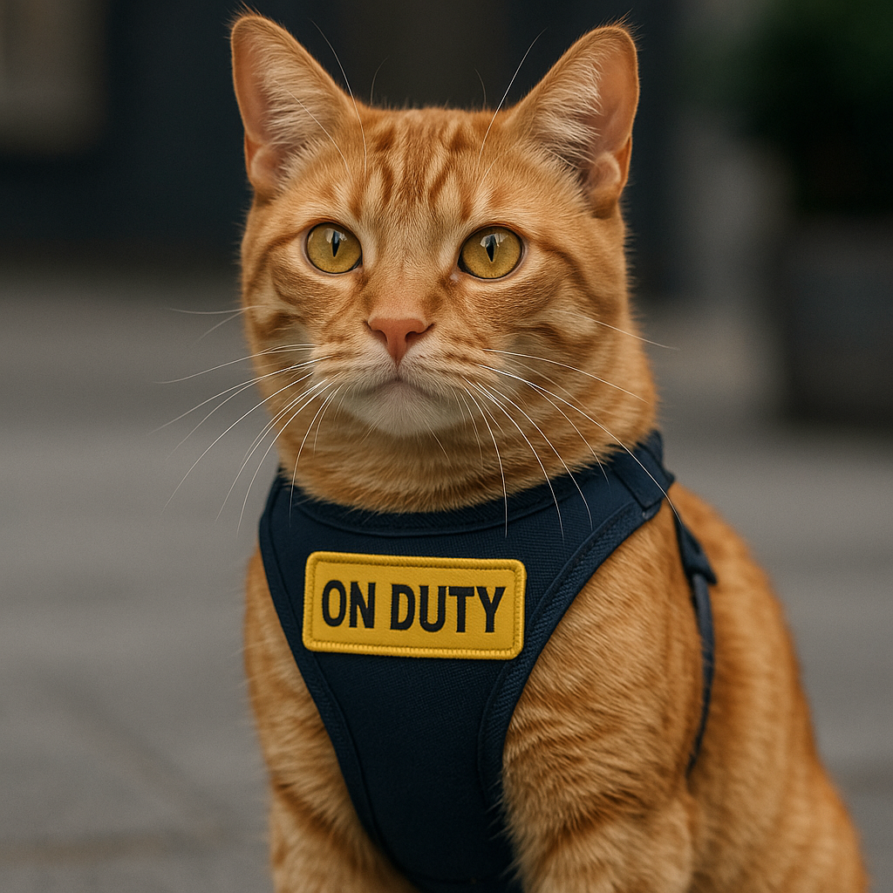
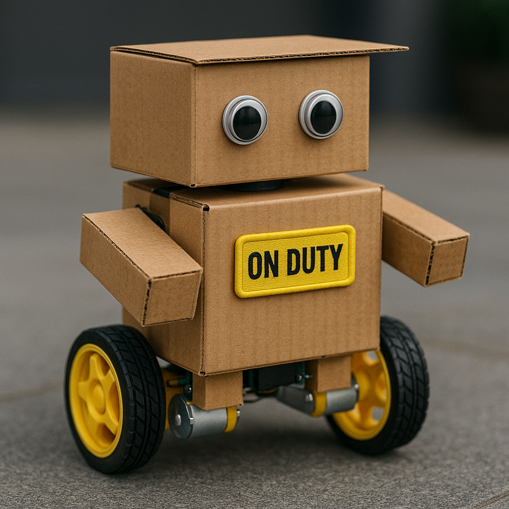

# ibi-the-watch-cat

An AI robot that observes its surroundings and watches YouTube.

The current project is a proof-of-concept prototype for a robot that uses microcontrollers, sigle-board computers, and AI models.

I'm exploring various aspects of its design and functionality.

There is a significant gap between the ideal and the expected. The goal is to minimize it.

<div align="center">
  
  
</div>

<br>

I'm thinking through things like:

    Key features: What specific tasks will it perform?
    -> observe surroundings and watch youtube

    Navigation: How will it move independently?
    -> ai model controls two/four wheels 

    Sensors: What technologies will it use to perceive its environment?
    -> some sensors, but mainly cameras for vision world models

I'm looking forward to refining these ideas as the project progresses!

## duties
```
monitor humidity
monitor temperature
watch youtube? - move/click/scroll the mouse with servos etc and watch the screen
understand voice command
understand sign or gesture
...
```
## hardware
```
arduino uno, micro, nano, nano esp32
raspberry pi 4 4MB
camera - pi cam, usb webcam
mic
AM2302 (DHT22) - Digital Temperature and Humidity Sensor
DS18B20 - 1-Wire Digital Temperature Sensor
relay
servo motor - sg90 180 360
qi transmitter and receiver
nickel-metal hydride (NiMH)
portable display or tablet
...etc
```
## software and ai
```
arduino ide 1.8.19 on pi
raspberry pi os 12 bookworm
ubuntu 24.04 for server hub
python
docker
fastapi
ssh tunnel - local and reverse proxy
.net9 maui blazor hybrid web 
(https://github.com/ibinti/ibi-the-watch-cat/blob/main/.net9-maui-blazor-hybrid-web.md)
mudblazor (https://mudblazor.com)
vps - vultr in osaka japan
    - best to test worst case control lags as it is quite far from vancouver canada
colab - ai model training and inferencing 
      - somewhere unknown google server
neural network - magic happens here
pytorch
blind source separation of mixture of mixture similiar to mixit
reinforcement learning somehow?
finetune open_clip for various downstream tasks
distill open_clip to tinyvit for edge device
accelerate (a pytorch library) for gpu(s) and tpu training
onnx
ollama
...etc
```

## todos

ibi needs a vision feedback system --> in progress

ibi needs a robotic camera system (i.e., an eyeball and neck) --> #19

ibi needs a hand-like system to click mouse --> #45

ibi needs a leg-like system to move around (i.e., two/four wheels) --> #44

