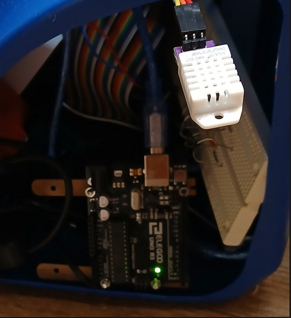

# ibi-the-watch-cat

Safety Monitor Watch AI Robot

I'm excited to share my Safety Monitor Watch AI Robot project. This project focuses on developing an AI robot using Arduino, Raspberry Pi and AI model trained on Colab.

I'm exploring various aspects of its design and functionality.

Currently, there is a significant gap between the ideal and the expected. The project goal is to minimize it.

<div align="center">
  
  
</div>

<br>

I'm thinking through things like:

    Key features: What specific tasks will it perform?

    Navigation: How will it move independently?

    Sensors: What technologies will it use to perceive its environment?

I'm looking forward to refining these ideas as the project progresses!

```
duties -
monitor humidity
monitor temperature
watch youtube? - move/click/scroll the mouse with servos etc and watch the screen
understand voice command
understand sign or gesture
...
```
```
hardware -
arduino
raspberry pi
camera
mic
sensors - AM2302 (DHT22) Digital Temperature and Humidity Sensor
relay
servo motor
qi transmitter and receiver
nickel-metal hydride (NiMH)
...etc
```
```
software -
raspberry pi os
ubuntu
python
docker
fastapi
ssh tunnel
.net9 maui blazor hybrid web with mudblazor
vps
...etc
```

```
ai/ml -
pytorch
blind source separation of mixture of mixture similiar to mixit
reinforcement learning somehow?
finetune open_clip for various downstream tasks
distill open_clip to tinyvit for edge device
use accelerate for gpu(s) and tpu training: a100,l4,t4,t4x2,p100,v3-8,v2-8
onnx
colab
ollama
...etc
```
<br>
2025.0712

arduino and raspberry pi 4 in the body box. run pi with ac-power adaptor.
let it to connect wifi and push heartbeat to ibinti.com/ibi-the-watch-cat
<br>
set up ssh tunnel and real vnc viewer<br>
```bash
ssh -L 5900:20.25.07.12:5900 ibi@20.25.07.12
VNC Server: localhost
ibi pushes heartbeat
```
<br>
2025.0713
<br>
real-time heartbeat

2025.0717
<br>
arduino on pi usb port
<br>
pyfirmata on pi controls arduino onboard led on/off/blink

youtube video demo

[](https://youtube.com/shorts/j8u58aLM6-E?feature=share)
<br>
<br>
2025.0719
<br>
NiMH charger and relays... NC -> discharging, NO -> charging

<div align="center">
  
  
</div>

<br>

2025.0720
<br>
AM2302 (DHT22) Digital Temperature and Humidity Sensor on Pi 4

Real-time sensor readig is shown at Live Stats (https://ibinti.com/ibi-the-watch-cat)

<div align="center">
  
</div>

<br>

2025.0727
<br>
todo: make a prototype moving pad with two servos for vertical and horizonal directions
<br>
use cardboard and masking tape. arduino needs longer usb cable extension to reach mouse on computer table
<br>
also need a little lift-up for the mouse so that the mouse pad easily move under it. here the mouse pad is a thick paper.

i need a vision feedback for position...
