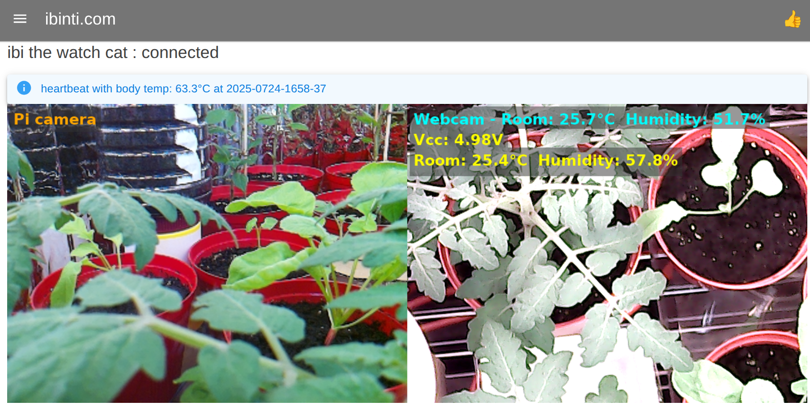
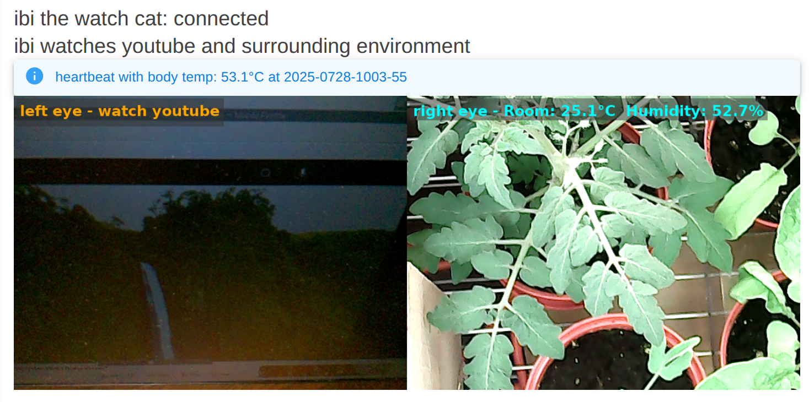

# ibi-the-watch-cat

An AI robot that observes its surroundings and watches YouTube.

The current project is a proof-of-concept prototype for a robot that uses Arduinos, Raspberry Pis, and AI models.

I'm exploring various aspects of its design and functionality.

There is a significant gap between the ideal and the expected. The goal is to minimize it.

<div align="center">
  
  
</div>

<br>

I'm thinking through things like:

    Key features: What specific tasks will it perform?
    -> observe surroundings and watch youtube

    Navigation: How will it move independently?
    -> ai model controls two/four wheels 

    Sensors: What technologies will it use to perceive its environment?
    -> some sensors, but mainly cameras for vision world models

I'm looking forward to refining these ideas as the project progresses!

```
duties -
monitor humidity
monitor temperature
watch youtube? - move/click/scroll the mouse with servos etc and watch the screen
understand voice command
understand sign or gesture
...
```
```
hardware -
arduino uno, nano
raspberry pi 4 4MB
camera - pi cam, usb webcam
mic
sensor - AM2302 (DHT22) Digital Temperature and Humidity Sensor
relay
servo motor - sg90
qi transmitter and receiver
nickel-metal hydride (NiMH)
portable display or tablet
mouse
...etc
```
```
software and ai -
arduino ide 1.8.19 on pi
raspberry pi os 12 bookworm
ubuntu 24.04 for server hub
python
docker
fastapi
ssh tunnel
.net9 maui blazor hybrid web 
(https://github.com/ibinti/ibi-the-watch-cat/blob/main/.net9-maui-blazor-hybrid-web.md)
mudblazor (https://mudblazor.com)
vps - vultr in osaka japan
    - best to test worst case control lags as it is quite far from vancouver canada
colab - ai model training and inferencing 
      - somewhere unknown google server
neural network
pytorch
blind source separation of mixture of mixture similiar to mixit
reinforcement learning somehow?
finetune open_clip for various downstream tasks
distill open_clip to tinyvit for edge device
use accelerate for gpu(s) and tpu training: a100,l4,t4,t4x2,p100,v3-8,v2-8
onnx
ollama
...etc
```
<br>
2025.0712

arduino and raspberry pi 4 in the body box. run pi with ac-power adaptor.
let it to connect wifi and push heartbeat to ibinti.com/ibi-the-watch-cat
<br>
set up ssh tunnel and real vnc viewer<br>
```bash
ssh -L 5900:20.25.07.12:5900 ibi@20.25.07.12
VNC Server: localhost
ibi pushes heartbeat
```
<br>
2025.0713
<br>
real-time heartbeat

2025.0717
<br>
arduino on pi usb port
<br>
pyfirmata on pi controls arduino onboard led on/off/blink

youtube video demo

[](https://youtube.com/shorts/j8u58aLM6-E?feature=share)
<br>
<br>
2025.0719
<br>
NiMH charger and relays... NC -> discharging, NO -> charging

<div align="center">
  
  
</div>

<br>

2025.0720
<br>
AM2302 (DHT22) Digital Temperature and Humidity Sensor on Pi 4

Real-time sensor reading is shown at Live Stats (https://ibinti.com/ibi-the-watch-cat)

<div align="center">
  
</div>

<br>

2025.0721
<br>
10 Pcs 9G SG90 Micro Servo Motors arrived! so tiny and cute, i love it.

<div align="center">
  
</div>

<br>

2025.0724
<br>
added pi4 camera. sensor readings on webcam view, light blue is measured w/ pi4, yellow w/ arduino
<br>
tip: install picamera2 and opencv using `apt install` system wide instead of `pip install` in venv, and then create venv w/ ` python3 -m venv --system-site-packages venv` this is not an ideal, but due to compatibility issues such as python version and numpy==1.24.2, best workaround so far.

<div align="center">
  
</div>

2025.0726
<br>
proof of concept moving pad with two servos for vertical and horizonal directions
<br>
use cardboard, masking tape and zip tie. arduino needs longer usb cable extension to reach mouse on computer table
<br>
there is no particular reason to keep the mouse upright normal position. keep the mouse in upside down and let the bottom laser diode light visible and simply cover a moving paper pad. use two paint roller like structure for moving pad control. this seems to be more effective and easier... use two more servos for mouse left and right click, and two more for scrolling, and last one for shutter or hopping

total 7 sg90 servos

<div align="center">
  
</div>

<br>
2025.0728

two eyes
<div align="center">
  
</div>


**todos:**

ibi needs a vision feedback system - in progress

ibi needs a robotic camera system (i.e., an eyeball and neck)

ibi needs a hand-like system to click mouse

ibi needs a leg-like system to move around (i.e., two/four wheels)