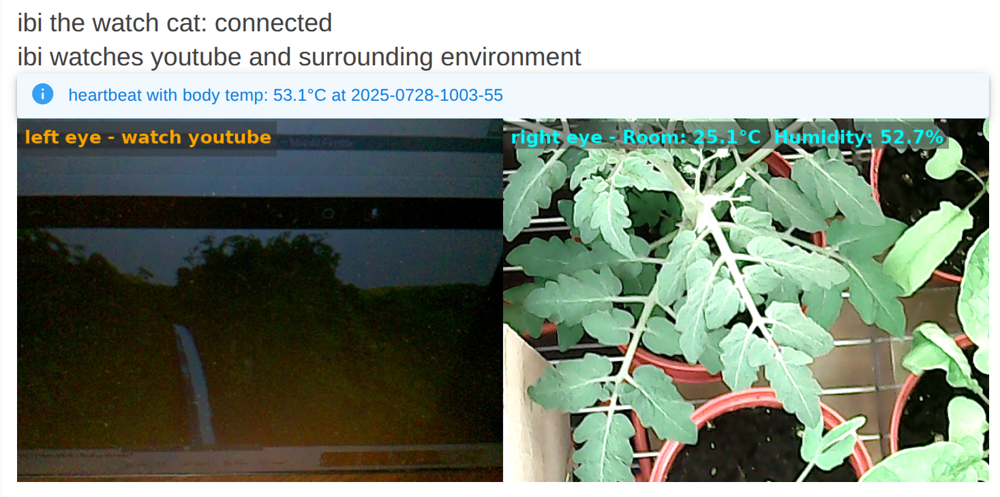
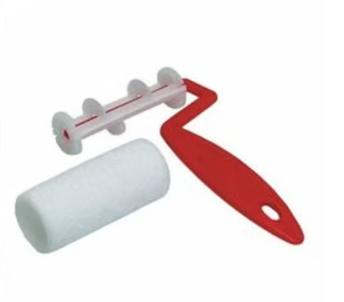
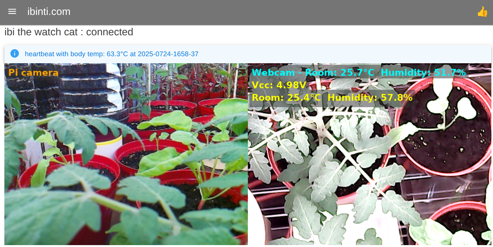
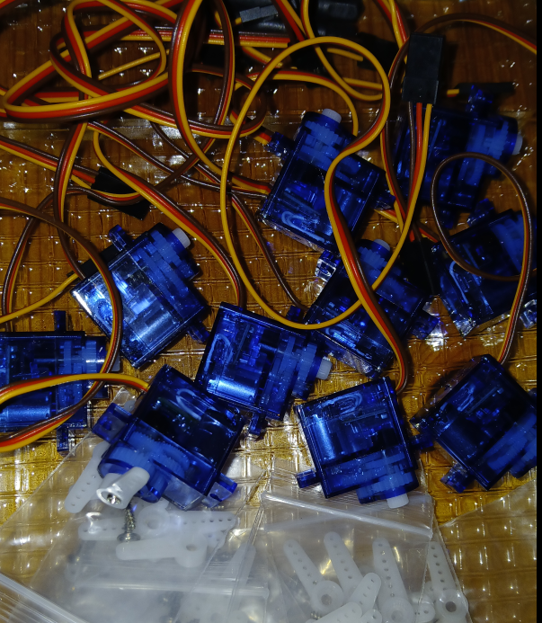
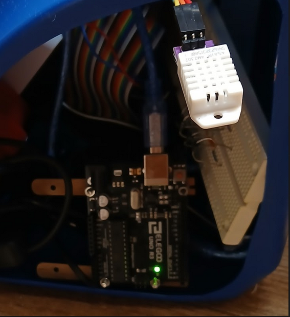
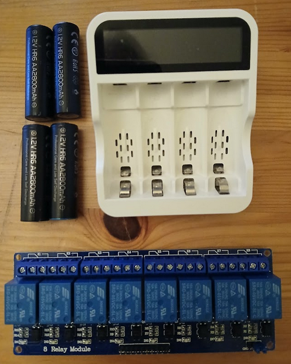
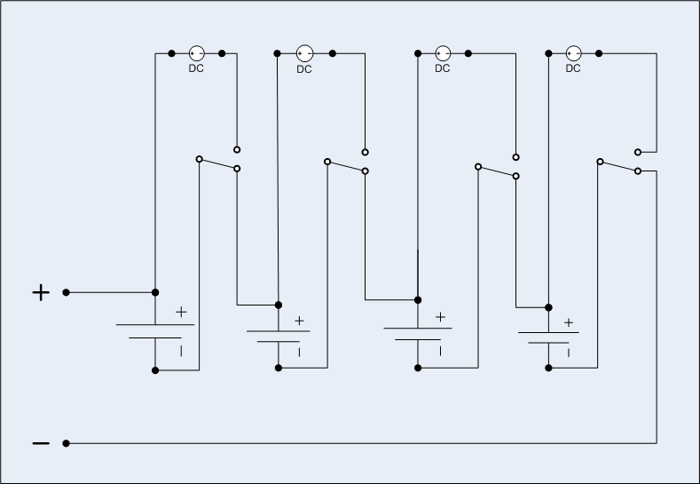

# log.md

<br>
2025.0819

3 dof pi cam, used three sg90 to create a mechanism for Pitch -> Yaw -> Roll

<br>
2025.0816

chicken detected

<br>
2025.0809

blazor united servers at osaka, toronto and colab receive messages sent from pi signalrcore at vancouver

<br>
2025.0728

two eyes
<div align="center">
  
</div>

<br>
2025.0726
<br>
proof of concept moving pad with two servos for vertical and horizonal directions
<br>
use cardboard, masking tape and zip tie. arduino needs longer usb cable extension to reach mouse on computer table
<br>
there is no particular reason to keep the mouse upright normal position. keep the mouse in upside down and let the bottom laser diode light visible and simply cover a moving paper pad. use two paint roller like structure for moving pad control. this seems to be more effective and easier... use two more servos for mouse left and right click, and two more for scrolling, and last one for shutter or hopping

total 7 sg90 servos

<div align="center">
  
</div>

<br>
2025.0724
<br>
added pi4 camera. sensor readings on webcam view, light blue is measured w/ pi4, yellow w/ arduino
<br>
tip: install picamera2 and opencv using `apt install` system wide instead of `pip install` in venv, and then create venv w/ ` python3 -m venv --system-site-packages venv` this is not an ideal, but due to compatibility issues such as python version and numpy==1.24.2, best workaround so far.

<div align="center">
  
</div>

<br>
2025.0721
<br>
10 Pcs 9G SG90 Micro Servo Motors arrived! so tiny and cute, i love it.

<div align="center">
  
</div>

<br>
2025.0720
<br>
AM2302 (DHT22) Digital Temperature and Humidity Sensor on Pi 4

Real-time sensor reading is shown at Live Stats (https://ibinti.com/ibi-the-watch-cat)

<div align="center">
  
</div>

<br>
2025.0719
<br>
NiMH charger and relays... NC -> discharging, NO -> charging

<div align="center">
  
  
</div>

<br>
2025.0717
<br>
arduino on pi usb port
<br>
pyfirmata on pi controls arduino onboard led on/off/blink

youtube video demo

[](https://youtube.com/shorts/j8u58aLM6-E?feature=share)
<br>

2025.0713
<br>
real-time heartbeat

2025.0712

arduino and raspberry pi 4 in the body box. run pi with ac-power adaptor.
let it to connect wifi and push heartbeat to ibinti.com/ibi-the-watch-cat
<br>
set up ssh tunnel and real vnc viewer<br>
```bash
ssh -L 5900:20.25.07.12:5900 ibi@20.25.07.12
VNC Server: localhost
ibi pushes heartbeat
```
<br>
